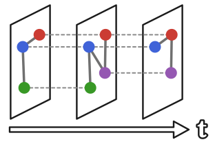
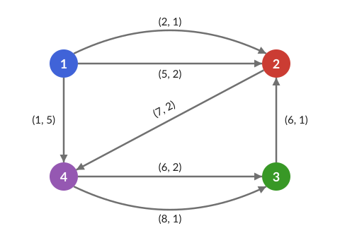
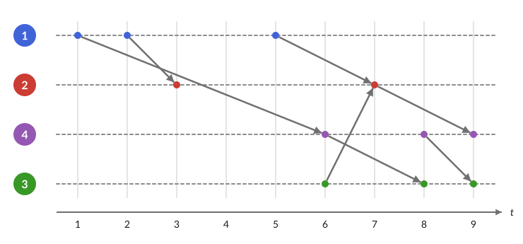

<p align="center"></p>

# TemporalGraphs.jl

Fast temporal graph analysis in pure Julia: temporal distances and optimal paths,
temporal centralities (closeness, betweenness, Katz, PageRank, walk centrality),
connectivity, flows and spanners, temporal motifs, isomorphisms and randomized models. 
Public temporal networks (SNAP, SocioPatterns) can be downloaded
directly, the temporal datasets of MLDatasets.jl can be loaded as temporal graphs, and
temporal graphs can be converted to GNNGraphs for GraphNeuralNetworks.jl.
The node set is fixed: only the edges change over time, and a node without edges at
some time is isolated then.

TemporalGraphs.jl is inspired by [TGLib](https://gitlab.com/tgpublic/tglib) (C++/Python,
Lutz Oettershagen and Petra Mutzel) and was built with the help of the Claude Opus 5.5 model.

## Installation

```julia
using Pkg
Pkg.add(url="https://github.com/aurorarossi/TemporalGraphs.jl")
```

## Example

A temporal graph with 4 nodes and 7 edges `(u, v, t, tt)`, each leaving `u` at time `t`
and reaching `v` at time `t + tt`; on the right, the same graph with one timeline per node:

<p align="center">
  
  &nbsp;&nbsp;
  
</p>

```julia
using TemporalGraphs

# edges (u, v, t, tt): from u to v, departing at t, arriving at t + tt
g = OrderedEdgeList(4, [(1, 4, 1, 5), (1, 2, 2, 1), (1, 2, 5, 2), (3, 2, 6, 1),
                        (4, 3, 6, 2), (2, 4, 7, 2), (4, 3, 8, 1)])

earliest_arrival_times(g, 1)          # [0, 3, 8, 6]
minimum_durations(g, 1)               # [0, 1, 7, 4]
minimum_duration_path(g, 1, 4)        # [(1 2 5 2), (2 4 7 2)]
temporal_closeness(g, Fastest())      # all nodes, in parallel
compute_topk_closeness(g, 2, Fastest())

g = load_dataset("CollegeMsg")        # or load_ordered_edge_list("file.txt"), lines u v t [tt]
```

## Citing

If you use TemporalGraphs.jl in your work, please cite:

```bibtex
@software{aurorarossi2026temporalgraphs,
  author    = {Aurora Rossi},
  title     = {TemporalGraphs.jl: Fast Temporal Graph Analysis in Julia},
  year      = {2026},
  version   = {0.1.0},
  url       = {https://github.com/aurorarossi/TemporalGraphs.jl}
}
```
